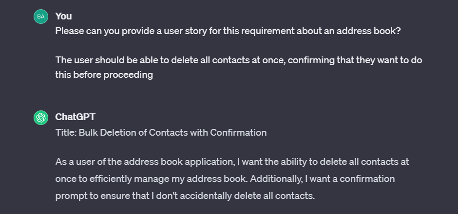
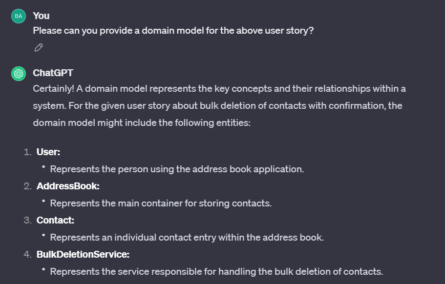
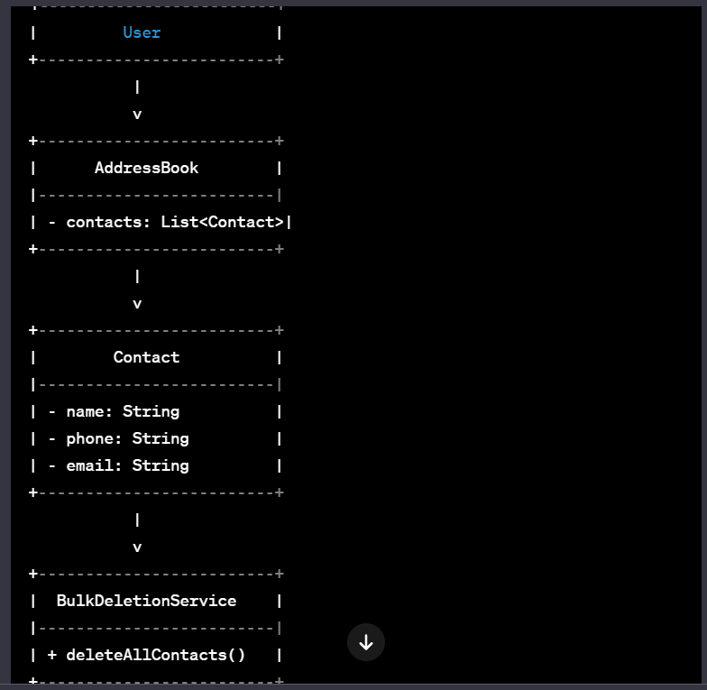
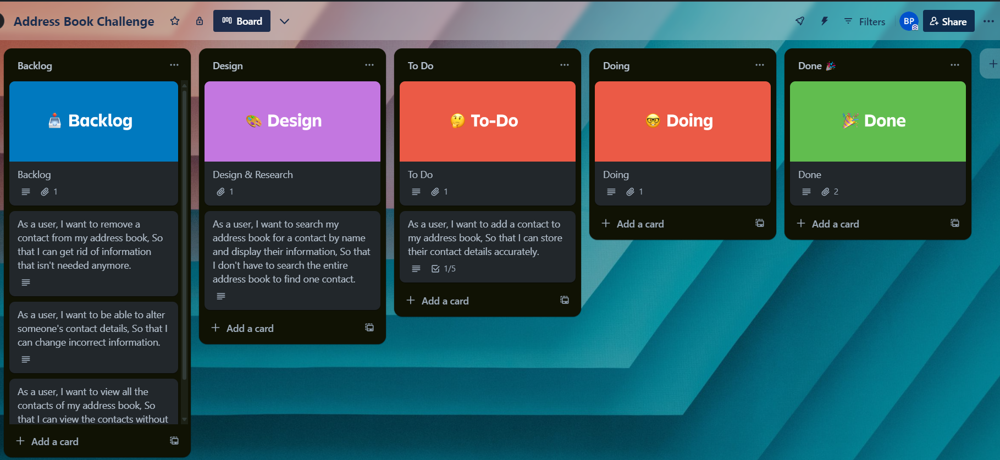
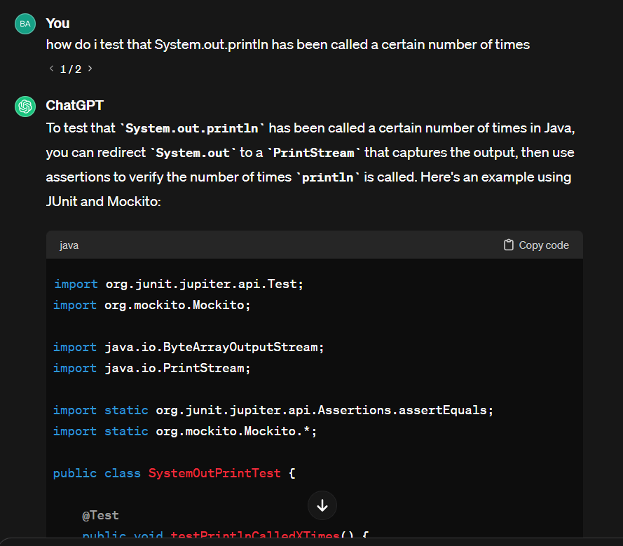
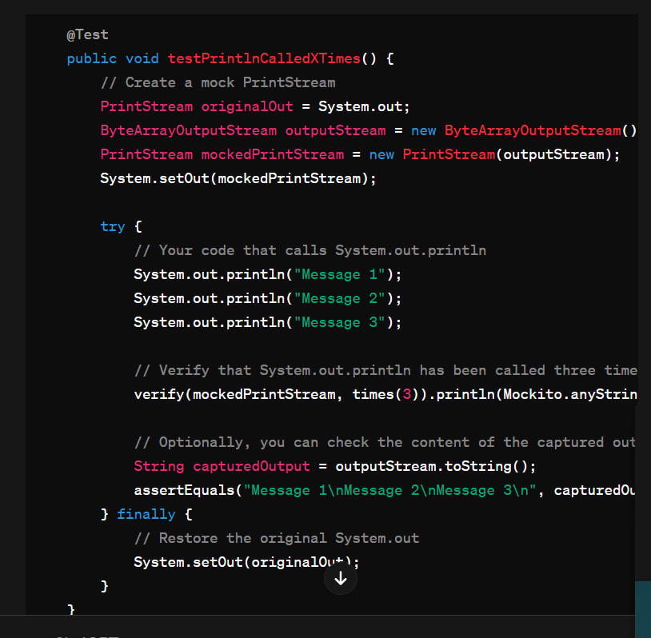
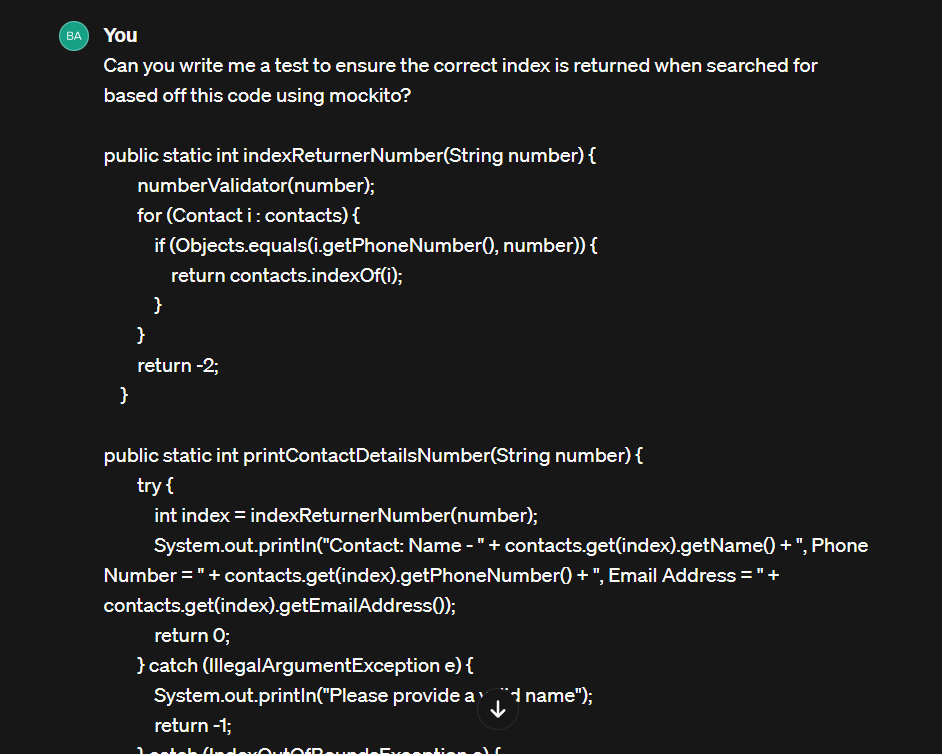
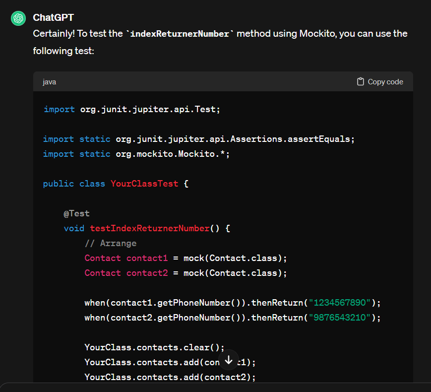
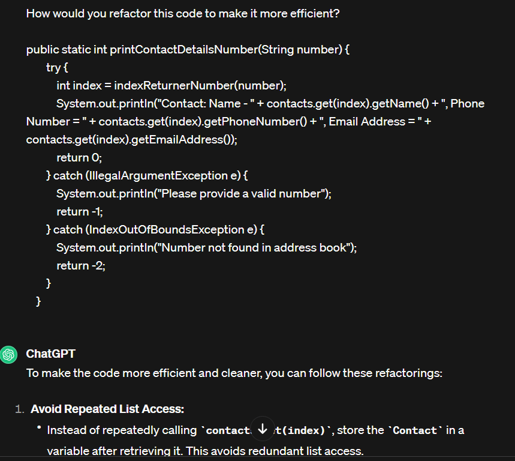

# Domain Models, Class Diagrams and Test Plan

### User Story 1

As a user,
I want to add a contact to my address book,
So that I can store their contact details accurately.

| Object       | Properties                                     | Messages                              | Output |
| ------------ |------------------------------------------------|---------------------------------------| ------ |
| Address Book | private static contactList@arrayList(contacts) | public static addContact(contactInfo) | @void  |
| Contact      | private name@String                            |                                       |        |
|              | private phoneNumber@String                     |                                       |        |
|              | private emailAddress@string                    |                                       |        |

### User Story 2

As a user,
I want to search my address book for a contact by name and display their information,
So that I don't have to search the entire address book to find one contact.

| Object       | Properties                                     | Messages                                     | Output            |
| ------------ |------------------------------------------------|----------------------------------------------| ----------------- |
| Address Book | private static contactList@arrayList(contacts) | public static searchContactList(contactName) | contactInfo@array |
| Contact      | private name@String                            |                                              |                   |

### User Story 3

As a user,
I want to remove a contact from my address book,
So that I can get rid of information that isn't needed anymore.

| Object       | Properties                                     | Messages                                 | Output |
| ------------ |------------------------------------------------|------------------------------------------| ------ |
| Address Book | private static contactList@arrayList(contacts) | public static removeContact(contactName) | @void  |
| Contact      | private name@String                            |                                          |        |

### User Story 4

As a user,
I want to be able to alter someone's contact details,
So that I can change incorrect information.

| Object       | Properties                                     | Messages                                                       | Output           |
| ------------ |------------------------------------------------|----------------------------------------------------------------| ---------------- |
| Address Book | private static contactList@arrayList(contacts) | public static searchContactList(contactName)                   | contactIndex@int |
| Contact      | private name@String                            | public editName(name@String, contactIndex@int)                 | @void            |
|              | private phoneNumber@String                     | public editPhoneNumber(phoneNumber@String, contactIndex@int)   | @void            |
|              | private emailAddress@string                    | public editEmailAddress(emailAddress@String, contactIndex@int) | @void            |

### User Story 5

As a user,
I want to prevent two users from having the same phone number or email address,
As only one person can own an email address / phone number.

| Object       | Properties                                     | Messages                                                | Output |
| ------------ |------------------------------------------------|---------------------------------------------------------|--------|
| Address Book | private static contactList@arrayList(contacts) | public static checkDuplicate(phoneNumber, emailAddress) | @void  |
| Contact      | private emailAddress@String                    |                                                         |        |
|              | private number@String                          |                                                         |        |

### User Story 6

As a user,
I want to view all the contacts of my address book,
So that I can view the contacts without necessarily searching.

| Object       | Properties                                     | Messages                               | Output                             |
| ------------ |------------------------------------------------|----------------------------------------| ---------------------------------- |
| Address Book | private static contactList@arrayList(contacts) | public static viewContact(contactInfo) | contactList@arrayList(contactName) |
| Contact      | private name@String                            |                                        |                                    |

### User Story 7

As a user,
I want to interact with the application via a console interface,
So that I can easily complete searches and view information.

### ADDITIONAL FEATURES

### User Story 8

As a user,
I want to search my address book for a contact by phone number and display their information,
So that I don't have to search the entire address book to find one contact.

| Object       | Properties                                     | Messages                                     | Output            |
| ------------ |------------------------------------------------|----------------------------------------------| ----------------- |
| Address Book | private static contactList@arrayList(contacts) | public static searchContactList(phoneNumber) | contactInfo@array |
| Contact      | private phoneNumber@String                     |                                              |                   |

## User Story 9

As a user,
I want to search my address book for a contact by email address and display their information,
So that I don't have to search the entire address book to find one contact.

| Object       | Properties                                     | Messages                                      | Output            |
| ------------ |------------------------------------------------|-----------------------------------------------| ----------------- |
| Address Book | private static contactList@arrayList(contacts) | public static searchContactList(emailAddress) | contactInfo@array |
| Contact      | private emailAddress@String                    |                                               |                   |

### User Story 10

As a user,
I want to search for a contact and have the results displayed in alphabetical order,
So that I can easily look through the list.

| Object       | Properties                      | Messages                       | Output            |
| ------------ |---------------------------------| ------------------------------ | ----------------- |
| Address Book | contactList@arrayList(contacts) | searchContactList(contactName) | contactInfo@array |
| Contact      | private name@String             |                                |                   |

### User Story 11 - AI used

As a user of the address book application,
I want the ability to delete all contacts at once to efficiently manage my address book. Additionally, I want a confirmation prompt to ensure that I don't accidentally delete all contacts.

### Initial Kanban Board

### AI Help - View All Contact Test

### AI Help - Writing Tests

### AI Help - Refactoring Code
